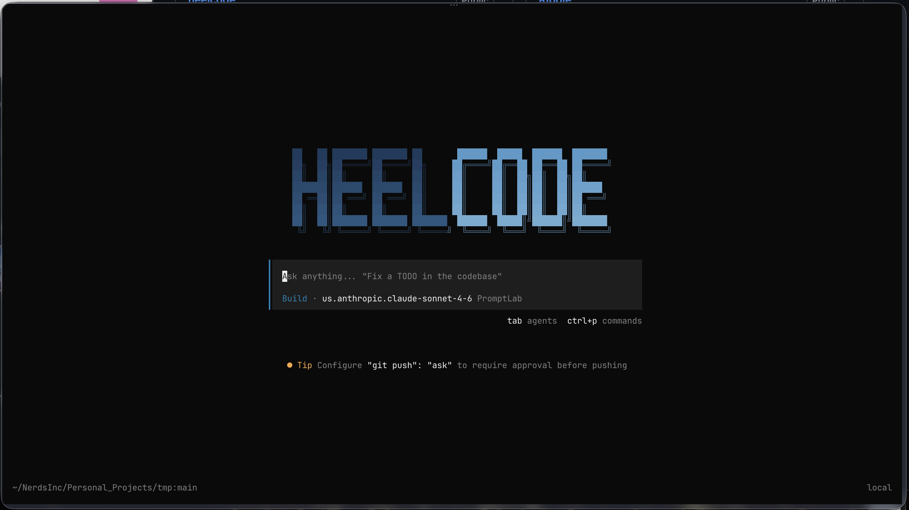

# heelcode

An open-source coding agent that uses UNC PromptLab models from your terminal.



## Quick start

Link this checkout once:

```bash
ln -sf "$(pwd)/packages/opencode/bin/opencode" "$HOME/.local/bin/heelcode"
```

Then run it in any project:

```bash
heelcode
```

HeelCode opens PromptLab in your normal Chrome profile, starts its local connector, and verifies your session before the TUI opens. If you need to sign in, complete the ONYEN/MFA flow in Chrome and rerun the command.

## What it does

- Discovers available PromptLab models automatically.
- Preserves provider-exposed reasoning while keeping tool execution, permissions, and task orchestration local.
- Uses a local `heelcode-promptlabd` connector; no credentials belong in this repository.

For setup details, architecture, model behavior, and troubleshooting, see [the PromptLab connector docs](docs/promptlab-connector.md).

## Based on OpenCode

HeelCode is a fork of [OpenCode](https://github.com/anomalyco/opencode).
